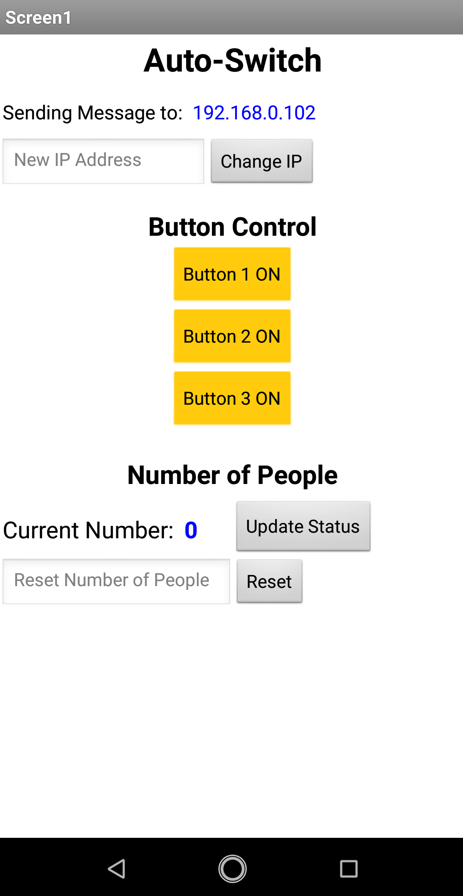

# Auto-Switch

## Introduction


## System Architecture


## Implementation

## Setting Up 
#### Set up the ESP32 Server
1. Connect the ESP32 to a pc and upload ```switch/switch.ino``` via Arduino IDE
   * Make sure to change the network credentials in ```switch/switch.ino```.
   * When uploading the code, the BOOT button on ESP32 should be pressed.
2. After pressing the EN button, open the Serial Monitor to know the **webpage URL**.

#### Set up the Laser and Sensor Module
1. Upload ```tmp.ino``` to the Arduino Board

#### Setting up Raspberry Pi
1. Connect Rpi to the same network ESP32 is connected to.
2. Connect the Arduino Board to Rpi with a usb cable.
   * Check the **port** the Arduino Board is using
3. Check the **IP address** of Rpi
4. Run the follwing command in terminal
```python
python auto_switch.py <port name> <IP address> <webpage URL>
```

#### Downloading the app (Optional: Allows manual control)
1. Download the app via command line
```
wget https://github.com/zytyz/Auto-Switch/releases/download/v0/AutoSwitch.apk
```
2. Run the .apk file on a Android Device

## Running
The switches are automatically controlled as people enter or exit the room. All switches are turned on when there are people remaining in the room, while all switches are turned off when everyone has exited.

The switches can also be manually controlled via the app. We can also check or reset the current number of people in the room as well.
#### App Interface
There are three parts of the app interface:
1. Setting IP address of Rpi
2. Controlling the Switches
3. Check the number of people remaining in the room
<p align="center">
   
   </br>
   App Interface
</p>


## Diffuculties and Solution
#### ESP32 Setup

1. Wrong Servo Library
   - An error occurred when trying to compile the code for ESP32.
    ```
      WARNING: library Servo claims to run on (avr, sam, samd, nrf52, stm32f4) architecture(s) and may be incompatible with your current board which runs on (esp32) architecture(s).
      In file included from C:\Users\My PC\Desktop\switch\switch\switch.ino:8:0:

      D:\Program\Arduino\libraries\Servo\src/Servo.h:73:2: error: #error "This library only supports boards with an AVR, SAM, SAMD, NRF52 or STM32F4 processor."

      #error "This library only supports boards with an AVR, SAM, SAMD, NRF52 or STM32F4 processor."

      ^

      exit status 1
      開發板 DOIT ESP32 DEVKIT V1 編譯錯誤。
    ```
   - We solved this problem by installing the ESP32_Arduino_Servo_Library
      - [github](https://github.com/RoboticsBrno/ServoESP32): uncompress the directory
      - [Import a library](https://www.arduino.cc/en/guide/libraries): make sure "ServoESP32" is in the library

2. Brownout detector was triggered (Shown in Serial Monitor)
   * When a button was pressed or the ESP32 sets up connection, an error "Brownout detector was triggered" might occur.
   * This results from a problem of the voltage supply of ESP32.
   * Solution ([reference](https://www.reddit.com/r/esp32/comments/brt87e/brownout_detector_was_triggered_when_activating/))
      * Change a usb cable
      * Do not power from a pc

#### Raspberry Pi Setup
1. Driver
   - Unable to install **Chrome** on RPi. Therefore, the original *ChromeDriver* won’t work.
   - Not able to find *Chromium Driver* for **Debian 10 armv7l**.
   - With the help of [樹莓派 Raspberry Pi 使用 Python + Selenium 控制 Chromium 瀏覽器](https://blog.gtwang.org/iot/raspberry-pi/raspberry-pi-install-chromium-chrome-driver/), finally a suitable driver for our system.
2. EXPORT PATH
   - For the code to work properly, `/usr/lib/chromium-browser/chromedriver` needs to be export to the `PATH`.
   - However, during the process, I’ve accidentally overwrite the original `PATH` which cause most of the block most of the commands.
   - Eventually, `echo "[original PATH]" >> ~/.bashrc` to enable all those commands and then add `chromedriver` to the `PATH`

## Precautions
1. Choose the right Board in the Arduino IDE
   * for ESP32, choose "DOIT ESP32 DEVKIT V1"
   * for Arduino UNO, choose "Arduino UNO"
2. When connecting to Rpi remotely, make sure to connect to the Raspberry Pi with X11 forwarding enabled.
```
ssh -X pi@192.xx.x.xx
```